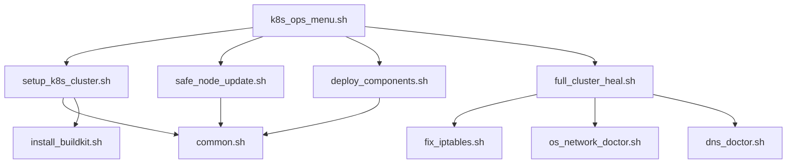

# OCI Kubernetes Cluster Scripts

This directory contains the complete toolkit for bootstrapping, managing, and maintaining a Kubernetes cluster on Oracle Cloud Infrastructure (OCI) ARM/AMD instances.

## 📂 Core Scripts

| Script | Purpose | Usage |
| :--- | :--- | :--- |
| **`k8s_ops_menu.sh`** | **The Main Command Center.** An interactive TUI (Text User Interface) that integrates all other scripts. Use this for day-to-day operations. | `./k8s_ops_menu.sh` |
| **`setup_k8s_cluster.sh`** | **The Bootstrapper.** Sets up the entire cluster from scratch (Kubeadm, Cilium, Longhorn). Idempotent-ish (skips init if already done). | `./setup_k8s_cluster.sh` |
| **`safe_node_update.sh`** | **OS Updater.** Safely updates nodes (apt upgrade / release upgrade) with Cordon/Drain workflow to prevent downtime. | `./safe_node_update.sh` |
| **`deploy_components.sh`** | **App Deployer.** Deploys applications from the `../components` directory. Handles manifests, tunnels, and ingress info. | `./deploy_components.sh` |

## 🛠️ Maintenance & Repair (The "Doctors")

| Script | Purpose | Usage |
| :--- | :--- | :--- |
| **`full_cluster_heal.sh`** | **The "Nuclear" Option.** Runs a sequence of fixes: IPTables -> OS Network -> DNS Doctor -> Rootless Cleanup -> Longhorn Heal. Use when everything is broken. | `./full_cluster_heal.sh` |
| **`dns_doctor.sh`** | **DNS Fixer.** Diagnoses and restarts CoreDNS and Cilium pods. Verifies DNS resolution from within pods. | `./dns_doctor.sh` |
| **`os_network_doctor.sh`** | **Host Network Fixer.** Fixes `/etc/resolv.conf`, `systemd-resolved`, and cleans up orphaned network namespaces on the host OS. | `./os_network_doctor.sh` |
| **`fix_iptables.sh`** | **Firewall Fixer.** Ensures critical K8s ports (6443, 4240, 8472, etc.) are open in `iptables`. | `./fix_iptables.sh` |

## 👁️ Observability & Monitoring

| Script | Purpose | Usage |
| :--- | :--- | :--- |
| **`scripts/observability/install_coroot.sh`** | **Coroot Installer.** Deploys Coroot full stack (Prometheus-based metrics, ClickHouse-based logs/traces) with automatic OCI pricing & Postgres discovery. | `./scripts/observability/install_coroot.sh` |
| **`scripts/observability/uninstall_coroot.sh`** | **Coroot Remover.** Cleanly removes Coroot namespace and resources. | `./scripts/observability/uninstall_coroot.sh` |

## 📦 Installers & Utilities

| Script | Purpose | Usage |
| :--- | :--- | :--- |
| **`common.sh`** | **Shared Library.** Contains common variables (Nodes, IPs, Versions) and helper functions (`run_remote`, `log_node`). Sourced by other scripts. | N/A (Library) |
| **`install_buildkit.sh`** | **BuildKit Installer.** Installs Rootless BuildKit for remote Docker builds. Used by `setup_k8s_cluster.sh`. | `./install_buildkit.sh` |
| **`reinstall_longhorn.sh`** | **Longhorn Installer.** Standalone script to install/reinstall Longhorn storage. Useful if storage is corrupted. | `./reinstall_longhorn.sh` |

## 🤖 Human vs. LLM Context

- **For Humans**: Start with `k8s_ops_menu.sh`. It exposes most functionality in a friendly menu. If you need to debug deep network issues, run `full_cluster_heal.sh`.
- **For LLMs**:
    - To **check health**: Run `kubectl get nodes` and `kubectl get pods -A`.
    - To **fix DNS**: Run `dns_doctor.sh`.
    - To **fix Network**: Run `fix_iptables.sh` then `os_network_doctor.sh`.
    - To **deploy apps**: Use `deploy_components.sh` (non-interactive mode supported via args).
    - To **update nodes**: Use `safe_node_update.sh`.

## 🔄 Integration Flow

