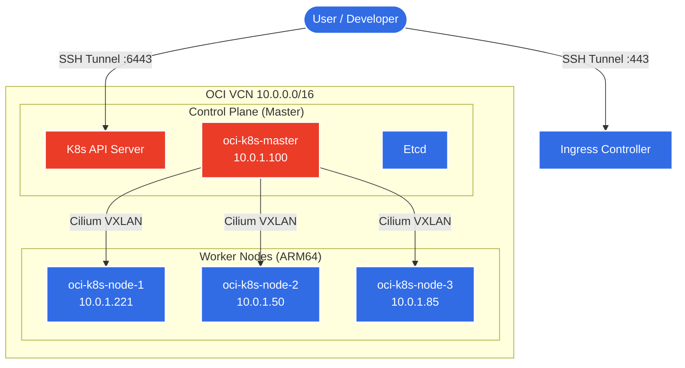
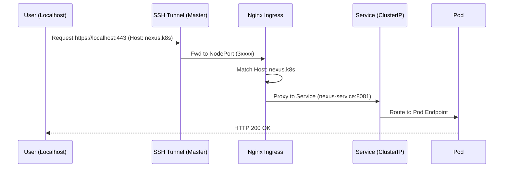
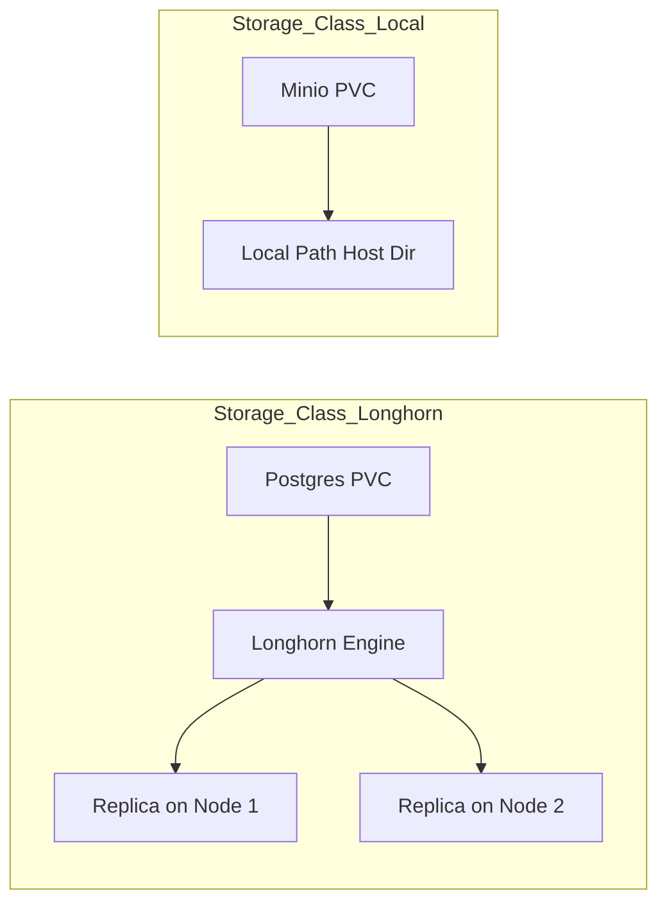

# OCI K8s Cluster Architecture

> [!NOTE]
> This document visualizes the "physical" and "logical" layout of the cluster. It bridges the gap between infrastructure (Nodes/Networking) and application delivery (Ingress/Services).

## 1. High-Level Topology
The cluster runs on Oracle Cloud Infrastructure (OCI) Free Tier, utilizing ARM64 Ampere instances. Connectivity is secured via a Bastion-like tunnel pattern.

## 2. Networking & Traffic Flow
Access to services is strictly controlled. There are no public LoadBalancers (cost saving). All traffic enters via Ingress (Nginx) which is exposed via **NodePort**, accessed through an **SSH Tunnel**.

## 3. Storage Architecture
We use a hybrid storage approach to balance performance and reliability on restricted hardware.

| Provisioner | Type | Use Case | Characteristics |
| :--- | :--- | :--- | :--- |
| **Longhorn** | Block (Distributed) | **Postgres, Nexus** | High Availability, Snapshots, Replicas (Heavy CPU/RAM usage). |
| **Local-Path** | HostPath | **Minio** | Raw IOPS speed, Simple. Data pinned to specific node. |

## 4. Key Components
- **CNI**: Cilium (VXLAN Mode, No Hubblest/Encryption yet).
- **Ingress**: NGINX Ingress Controller.
- **TUI**: `k8s_ops_menu.sh` (The "Command Center" for all operations).
