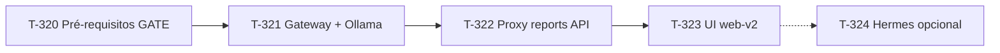

# T-315: Fleet Copilot — Epic overview (Hermes/Gemma @ SSDNodes + chat reports)

- **Status**: Done (MVP 2026-05-31, PR #367)
- **Priority**: 🔼 High
- **Owner**: Cursor / AI Radar
- **Epic**: Fleet Copilot
- **Est**: ~2–3 semanas (MVP T-320→323); +1 semana opcional (T-324)
- **Origem**: Discussão “Gemma em SSDNodes” + chat em `reports.dnor.io` para verificar estado do monstro com **zero custo variável**

## Visão

Assistente **read-only** integrado ao Node Fleet:

- Operador pergunta em linguagem natural (presets seguros)
- Backend coleta fatos via **fleet-ops-gateway** (comandos hardcoded)
- **Ollama + Gemma/Qwen** no `ssdnodes-monstro` sintetiza resposta grounded
- **reports.dnor.io** autentica, rate-limita e faz proxy — **nunca** expõe Ollama ao browser

**Hermes Agent** é **opcional** (T-324), só após MVP validado.

## Princípios de segurança (não negociáveis)

1. **Fail-closed** — feature desligada por default
2. **Zero write** — nenhum kubectl apply/delete, systemctl stop, shell arbitrário na v1
3. **Contexto server-side** — browser não envia system prompt nem contexto
4. **Ollama localhost** — porta 11434 nunca pública
5. **Auth obrigatória** — padrão qdbback (login key → cookie HttpOnly)
6. **Audit trail** — hash do prompt + endpoints chamados
7. **Zero Variable Cost** — inferência local; sem OpenRouter no path crítico

## Mapa de epics

| ID | Nome | Est. | Arquivo |
|----|------|------|---------|
| **T-320** | Pré-requisitos segurança (SSH, UFW, Tailscale, Dashboard RBAC, ADR runner) | 3d | [T-320-Fleet-Copilot-Security-Prerequisites.md](T-320-Fleet-Copilot-Security-Prerequisites.md) |
| **T-321** | Ops Gateway + Ollama @ SSDNodes | 3d | [T-321-Fleet-Ops-Gateway-Ollama-SSDNodes.md](T-321-Fleet-Ops-Gateway-Ollama-SSDNodes.md) |
| **T-322** | Proxy seguro rs-observability-api | 3d | [T-322-Fleet-Copilot-Proxy-Reports-API.md](T-322-Fleet-Copilot-Proxy-Reports-API.md) |
| **T-323** | UI Fleet Copilot no reports | 2d | [T-323-Fleet-Copilot-UI-Reports.md](T-323-Fleet-Copilot-UI-Reports.md) |
| **T-324** | Hermes Agent fase 2 (opcional) | 2d | [T-324-Hermes-Agent-Phase2-Optional.md](T-324-Hermes-Agent-Phase2-Optional.md) |

**Relacionados:**

- [T-310](T-310-SSDNodes-SSH-bruteforce-diagn-stico-e-monitoria.md) — overlap com T-320a
- [T-303](T-303-SSDNodes-Dashboard-Kubecost-HTTPS.md) — follow-up RBAC T-320d
- [T-296](T-296-qdbback-AWS-EC2-Honeypot-Node-Fleet-Threats-Card.md) — padrão auth/IP allowlist

## MVP Definition of Done

- [ ] Operador autenticado pergunta “Como está o disco no SSDNodes?” em `reports.dnor.io/#nodes`
- [ ] Resposta cita fontes (`/ops/host/disk`, etc.) com dados reais
- [ ] Ollama inacessível da internet (`curl 104.225.218.78:11434` falha)
- [ ] Rate limit dispara em abuse (429)
- [ ] Audit log registra interações
- [ ] Feature desligável via `FLEET_COPILOT_ENABLED=false`
- [ ] Manifests/scripts versionados em `components/ssdnodes/` + `apps/fleet-ops-gateway/`

## Fora de escopo (MVP)

- Auto-remediação (“restart pod X”)
- Chat público sem auth
- OpenRouter / APIs LLM pagas
- Hermes messaging bots
- Write kubectl / systemctl via LLM
- Histórico longo de conversas no Postgres (só audit metadata)

## Sequência recomendada de execução

1. **T-320a + 320b + 320e** (gate) — paralelo **320c + 320d**
2. **T-321a** spike → **321b–321e**
3. **T-322a–322e** (322f SSE pode esperar T-323c)
4. **T-323a–323d**
5. Estabilização 2 semanas → decidir **T-324**

## Referências técnicas no repo

| Tópico | Path |
|--------|------|
| Node Fleet UI | `apps/rs-observability-api/web-v2/src/components/NodesPanel.tsx` |
| API routes | `apps/rs-observability-api/src/app.rs` |
| Auth referência | `apps/qdbback/services/monitorAuth.js` |
| UFW SSDNodes | `oci-k8s-cluster/scripts/hardening/ufw_manager.sh` |
| Fleet registry | `config/external-fleet/registry.yaml` |
| Rede OCI | `docs/network-access-architecture.md` |
| Zero cost policy | `AGENTS.md` |
| LLM pacing ref | `apps/ai-radar/crates/ai-radar-core/src/llm/pace.rs` |
