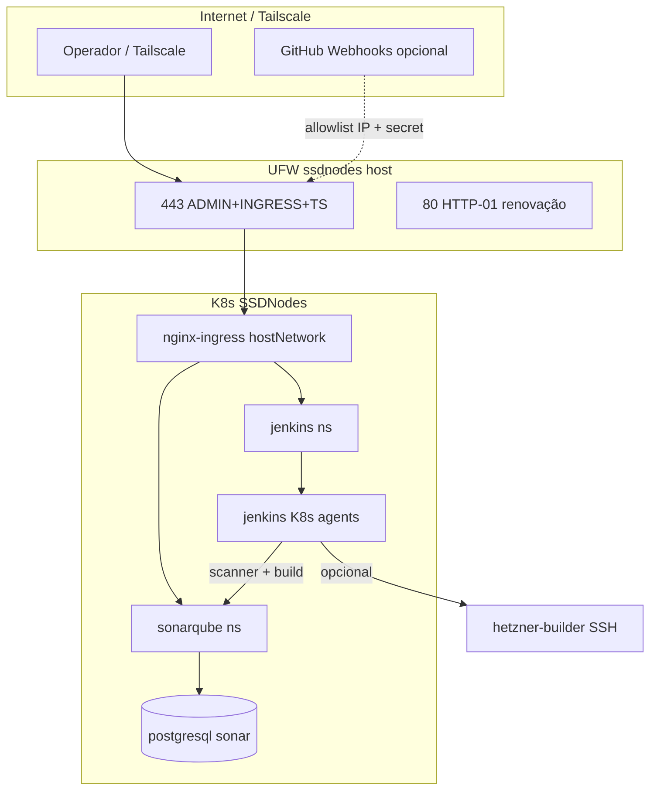

# T-341: SSDNodes — Plataforma CI (Jenkins + SonarQube CE)

- **Status**: Done
- **Priority**: 🔼 High
- **Owner**: DevExp / Tooling (infra SSD: Copilot ou Codex com handoff explícito)
- **Epic**: Infra / ssdnodes-6a12f10c9ef11
- **Est**: 3–5d (faseado; não big-bang)
- **Criado**: 2026-06-04

## Context

Hoje o CI do monorepo está **distribuído e leve por design** (T-141):

- **Hetzner** — build ARM64 (`hetzner-builder`) + deploy apps OCI
- **GitHub Actions** — quality gates + CodeQL no runner `ssdnodes` (x86)
- **Harness local** — `tools/harness/verify-changed` (sem SonarQube)

O cluster K8s no **SSDNodes** (`104.225.218.78`, 12 vCPU / 60 GiB / ~1.1 TiB) já hospeda workloads de plataforma com padrão maduro:

- `nginx-ingress` (hostNetwork 80/443) + `cert-manager` (HTTP-01)
- Domínios `*.ssdnodes.dnor.io` (MinIO, Dashboard, Kubecost)
- Deploy remoto via `deploy_ssdnodes_components.sh` + entradas TUI (Hardening 10–14)
- UFW hardened + `cert-renew-ufw` timer

**Por que Jenkins + Sonar aqui (e não na OCI)?**

| Fator | OCI Ampere | SSDNodes |
|-------|------------|----------|
| CPU/RAM | 1 vCPU / 6 GiB por nó | 12 vCPU / 60 GiB dedicado |
| Arquitetura | ARM64 | x86_64 (CodeQL, scanners JVM) |
| Filosofia | Stability First — apps prod | Host “general purpose” + CI colocation já aceita (ADR T-320c) |
| Custo variável | Proibido | Self-hosted CE = **zero** SaaS |

T-141 excluiu SonarQube na **fase harness MVP**. Este epic **reabre escopo** via ADR dedicado (T-341-0): Sonar **complementa** clippy/eslint/harness — não substitui gates leves.

Legado `9. jenkins/` = minikube 2024; **não reutilizar** — migrar ideias (JCasC, plugins) para `components/ssdnodes/jenkins/`.

### Domínios propostos

| Host | Serviço | Backend |
|------|---------|---------|
| `jenkins.ssdnodes.dnor.io` | Jenkins LTS (UI + API) | Service :8080 |
| `sonar.ssdnodes.dnor.io` | SonarQube Community | Service :9000 |
| _(interno)_ | PostgreSQL Sonar | ClusterIP only |

Registros **A** → `104.225.218.78` (mesmo padrão T-300/T-303).

### Arquitetura alvo



### Postura de segurança (obrigatória)

1. **Exposição** — só 443 público restrito (UFW existente); preferir **Tailscale** para uso diário.
2. **Jenkins** — `allowsSignup: false`, admin via Secret + JCasC; agent listener **ClusterIP** (sem NodePort 50000); builds em **pod agents** no cluster, não no host.
3. **SonarQube** — `sonar.forceAuthentication=true`; token de CI em K8s Secret; **sem** upload anônimo; DB não exposto.
4. **NetworkPolicy** — namespace `jenkins` ↔ `sonarqube` ↔ `sonarqube-db` mínimo necessário.
5. **Colocation** — revisar ADR T-320c: Jenkins executa código de PR → mesmo blast radius que CodeQL; mitigar com namespaces isolados, `restricted` PSA, sem secrets OCI no runner env.
6. **Webhooks GitHub** — ingress secundário `/github-webhook/` com annotation `whitelist-source-range` (IPs GitHub) + HMAC secret; alternativa MVP: **poll SCM** (zero superfície webhook).
7. **Credenciais** — nunca no Git; `create_*_secret.sh` ou SealedSecret pattern; credstore local documentado.

### Orçamento de recursos (estimativa)

| Componente | requests | limits | PVC |
|------------|----------|--------|-----|
| Jenkins controller | 500m / 2Gi | 2 / 4Gi | 20Gi local-path |
| Jenkins agent (burst) | 1 / 2Gi | 4 / 8Gi | ephemeral |
| SonarQube CE | 1 / 2Gi | 2 / 4Gi | 10Gi |
| PostgreSQL 15 | 250m / 512Mi | 1 / 2Gi | 20Gi |

**Total steady ~6–8 GiB** + picos agent — cabe nos 60 GiB com Kubecost/MinIO/Ollama se limitarmos `containerCap` Jenkins (ex.: 2).

### Integração repo (IaC / TUI / harness)

| Camada | Ação |
|--------|------|
| **IaC** | `components/ssdnodes/jenkins-values.yaml`, `jenkins-ingress.yaml`, `sonarqube-values.yaml`, `sonarqube-ingress.yaml`, `sonarqube-postgresql-values.yaml` |
| **Deploy** | Estender `deploy_ssdnodes_components.sh` → `jenkins`, `sonarqube`, `ci-platform` (ordem: PG → Sonar → Jenkins) |
| **TUI** | Novo submenu **SSDNodes — CI Platform** (ou Hardening 15–18): deploy, status, token rotate doc |
| **Guardrail** | Excluir `components/ssdnodes` de seleção acidental em `deploy_components.sh` OCI (warning/block) |
| **Catalog** | Entradas em `generate_catalog.sh` / inventário reports |
| **Harness** | Fase 2: `validate_ssdnodes_ci.sh` (curl TLS + Sonar `/api/system/status` + Jenkins `/login`) |
| **Quality** | Jenkinsfile ou Job DSL chamando `tools/harness/verify-changed` + Sonar scanner pós-build |

## Fases e sub-tasks

### T-341-0 — ADR e rescope T-141 (gate)

- [x] ADR `components/ssdnodes/ADR-jenkins-sonarqube-colocation.md` (aceitar/rejeitar Sonar CE; relação com CodeQL runner)
- [x] Atualizar T-141 “não objetivos” com nota “Sonar CE permitido via T-341 ADR”
- [ ] Capacity review no host (kubectl top, RAM livre, disco MinIO 500Gi)

### T-341-1 — PostgreSQL + SonarQube CE

- [x] DNS `sonar.ssdnodes.dnor.io` → A record (GoDaddy API)
- [x] Namespace `sonarqube`; Helm Bitnami PostgreSQL (`sonarqube-postgresql-values.yaml`)
- [x] Helm SonarQube CE (SonarSource chart) com JDBC → Postgres interno
- [x] Ingress + TLS (`sonarqube-ingress.yaml`)
- [x] Secret helper (`create_sonar_ci_secrets.sh` — imprime apply YAML)
- [x] NetworkPolicy (`ci-network-policies.yaml`)
- [x] Validar: `https://sonar.ssdnodes.dnor.io` login + `/api/system/status`

### T-341-2 — Jenkins LTS + K8s agents

- [x] DNS `jenkins.ssdnodes.dnor.io` → A record
- [x] Namespace `jenkins`; Helm `jenkinsci/jenkins` (`jenkins-values.yaml` — ClusterIP, persistence 20Gi)
- [x] Plugins mínimos: kubernetes, git, workflow-aggregator, configuration-as-code, sonar
- [x] Ingress principal UI (`jenkins-ingress.yaml`); **sem** NodePort legado
- [x] Pod template agent x86 com `containerCap: 2`
- [x] Integração Sonar: credencial `sonar-token` + server URL em JCasC
- [x] Validar: login, agent pod sobe, multibranch `production-site` (citools)

### T-341-3 — Segurança e exposição

- [ ] UFW: confirmar 443-only posture; HTTP-01 via `open_port80_for_certs` / `cert-renew-ufw`
- [ ] Opcional webhook: `jenkins-github-webhook-ingress.yaml` com IP allowlist
- [ ] Dashboard-style RBAC: ServiceAccount Jenkins com Role mínima (não cluster-admin)
- [ ] Documentar rotação admin/token em `components/ssdnodes/README.md`
- [ ] Pentest leve checklist (reuse T-324 patterns)

### T-341-4 — TUI + deploy script + docs

- [x] `deploy_ssdnodes_components.sh`: targets `sonarqube`, `jenkins`, `ci-platform`, `ci-status`
- [x] `configure_ssdnodes_ci_dns_godaddy.sh` + `export_ci_credentials.sh`
- [x] `k8s_ops_menu.sh`: Hardening 15–17 (Sonar, Jenkins, CI Platform)
- [x] Harness: `scripts/harness/validate_ssdnodes_ci.sh`
- [x] README seção “CI Platform” + links domínios
- [x] Block `deploy_components.sh` se component == ssdnodes

### T-341-5 — Integração monorepo (opcional / fase 2)

- [x] **citools MVP** (`tools/citools`) + `pipeline.yaml` + `Jenkinsfile.generic` (ADR citools)
- [x] Job multibranch Jenkins `production-site` (`setup_jenkins_ci_jobs.sh` + `seed_jenkins_ci_job.sh`)
- [ ] Badge/link Sonar quality gate no README ou reports (opcional)
- [ ] Avaliar migrar CodeQL runner para Hetzner (libera RAM — ADR T-320c opção A)

## Critérios de aceite (MVP)

- [ ] `https://sonar.ssdnodes.dnor.io` — TLS válido, auth obrigatória, Postgres persistente
- [ ] `https://jenkins.ssdnodes.dnor.io` — TLS válido, signup desabilitado, JCasC versionado no Git
- [ ] Pipeline de exemplo publica análise no Sonar
- [ ] Deploy reproduzível via TUI (1–2 cliques) + script SSH idempotente
- [ ] Nenhum secret commitado; UFW posture inalterada ou documentada
- [ ] MinIO / Kubecost / Fleet Copilot **sem regressão** (smoke URLs existentes)

## Riscos

| Risco | Mitigação |
|-------|-----------|
| RAM pressure (Ollama + Kubecost + CI) | limits + containerCap; monitor Kubecost |
| HTTP-01 / UFW drift | reutilizar `cert-renew-ufw.timer` |
| Sonar + Jenkins JVM no mesmo nó | requests/limits; PriorityClass opcional |
| Duplicação CI (GHA + Jenkins) | Jenkins = orquestrador local; GHA mantém CodeQL até ADR migrar |
| Deploy acidental na OCI | guardrail deploy_components |

## Referências

- [components/ssdnodes/README.md](../../../components/ssdnodes/README.md)
- [T-303 SSDNodes Dashboard Kubecost](../../../tasks/2026/Q2/T-303-SSDNodes-Dashboard-Kubecost-HTTPS.md)
- [ADR-runner-ai-colocation.md](../../../components/ssdnodes/ADR-runner-ai-colocation.md)
- [T-141 Harness Program](../../../tasks/2026/Q2/T-141-Repo-Quality-Harness-and-Delivery-Gates-Program.md)
- Legado: [9. jenkins/](../../../9.%20jenkins/) (minikube — só referência)

## Validação

```bash
export KUBECONFIG=~/.kube/ssdnodes.yaml
bash oci-k8s-cluster/scripts/ssdnodes/deploy_ssdnodes_components.sh ci-status
curl -fsSI https://sonar.ssdnodes.dnor.io/api/system/status
curl -fsSI https://jenkins.ssdnodes.dnor.io/login
# Pós-implementação:
# bash scripts/harness/validate_ssdnodes_ci.sh
```
