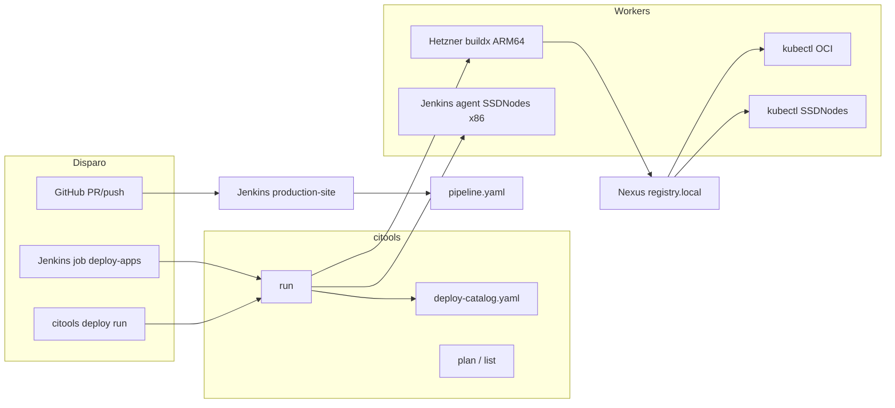

# T-344: Program — citools deploy + CI closure (epic)

- **Status**: 📋 Backlog
- **Priority**: 🔼 High
- **Owner**: Cursor / AI Radar
- **Epic**: T-341 SSDNodes CI Platform → T-344 Deploy Program
- **Est**: 3w (faseado)
- **Criado**: 2026-06-06

## Context

Fechamos **quality CI** (verify, CodeQL, Sonar) via Jenkins multibranch + `pipeline.yaml`, mas faltam:

1. **Enforcement no GitHub** — branch protection + webhook
2. **Deploy de apps** — hoje só `apps/*/deploy.sh` manual; build Hetzner → push Nexus → `kubectl` OCI
3. **Orquestração unificada** — mesmo padrão citools: declarative YAML, Jenkins genérico, local = CI

**Princípio:** `deploy.sh` **permanece** (implementação por app). citools adiciona **catálogo + workers + jobs Jenkins** para build/deploy pontual sem duplicar lógica.

## Arquitetura alvo



## Backlog (filhas)

| Fase | ID | Entrega | Depende de |
|------|-----|---------|------------|
| **1 — CI closure** | [T-345](T-345-GitHub-branch-protection-Jenkins-webhook.md) | `jenkins/citools` required + webhook GitHub | T-341 live |
| **2 — Catálogo** | [T-346](T-346-citools-deploy-catalog-CLI-list-plan-run.md) | `deploy-catalog.yaml` + `citools deploy list/plan/run` | — |
| **3 — Workers** | [T-347](T-347-Deploy-workers-Hetzner-OCI-SSDNodes.md) | Workers Hetzner/OCI/SSDNodes; wrap `deploy-buildx.sh` | T-346 |
| **4 — Jenkins deploy** | [T-348](T-348-Jenkins-deploy-jobs-apps-pontuais.md) | Job parametrizado + `pipeline-deploy.yaml` | T-346, T-347 |

## Catálogo de apps (draft)

| App | Build worker default | Deploy target default | deploy.sh |
|-----|---------------------|----------------------|-----------|
| py-back-end | hetzner (arm64) | oci | `apps/py-back-end/deploy.sh` |
| back-end | hetzner | oci | `apps/back-end/deploy.sh` |
| rs-axum-back-end | hetzner | oci | `apps/rs-axum-back-end/deploy.sh` |
| rs-observability-api | hetzner | oci | `apps/rs-observability-api/deploy.sh` |
| agent-meter | hetzner | oci | `apps/agent-meter/deploy.sh` |
| ai-radar | hetzner | oci | `apps/ai-radar/deploy.sh` |
| gta-vi | hetzner | oci | `apps/gta-vi/deploy.sh` |
| tor | hetzner | oci | `apps/tor/deploy.sh` |

**SSDNodes target:** apps x86-only ou colocation (ex. futuro workload no monstro) — opt-in no catálogo.

## Contrato citools deploy (draft)

```yaml
# tools/citools/deploy-catalog.yaml
version: 1
apps:
  - id: py-back-end
    path: apps/py-back-end
    script: ./apps/py-back-end/deploy.sh
    build:
      worker: hetzner          # hetzner | ssdnodes-agent | local
      platform: linux/arm64
    deploy:
      target: oci              # oci | ssdnodes
      kubeconfig: oci-tunnel   # env ref, nunca path absoluto no git
    whenPaths: apps/py-back-end/**
```

```bash
citools deploy list
citools deploy plan --app py-back-end --target oci
citools deploy run --app py-back-end --target oci --dry-run
# Jenkins: citools deploy run --app ${APP} --target ${TARGET}
```

Env injetados pelo worker (não alterar deploy.sh na fase 1):

| Env | Worker |
|-----|--------|
| `CITOOLS_BUILD_WORKER=hetzner` | força `deploy_select_buildx_builder` |
| `KUBECONFIG` | OCI tunnel ou `~/.kube/ssdnodes.yaml` |
| `DEPLOY_TARGET=oci\|ssdnodes` | futuro: branches no deploy.sh |

## Critérios de aceite (programa)

- [ ] PR em `main` bloqueado sem `jenkins/citools` green
- [ ] Push branch dispara build CI via webhook (não só poll)
- [ ] `citools deploy run --app py-back-end` = paridade com `./deploy.sh` manual
- [ ] Jenkins job `deploy-apps` com parâmetros APP + TARGET
- [ ] ADR + docs; `deploy.sh` intactos como escape hatch
- [ ] Harness: `validate_citools_deploy.sh` (dry-run plan)

## Referências

- [ADR citools](components/ssdnodes/ADR-citools-harness-evolution.md)
- [ADR citools deploy workers](components/ssdnodes/ADR-citools-deploy-workers.md)
- [deploy-buildx.sh](oci-k8s-cluster/scripts/lib/deploy-buildx.sh)
- [ci-jenkins-migration.md](docs/ci-jenkins-migration.md)
- [T-341](T-341-SSDNodes-Jenkins-SonarQube-Platform.md)

## Tasks (epic)

- [ ] T-345 CI closure
- [ ] T-346 catálogo + CLI
- [ ] T-347 workers
- [ ] T-348 Jenkins deploy job
- [ ] ADR citools-deploy-workers merged
- [ ] Atualizar CURSOR-QUEUE + fechar gaps T-341-3/5
